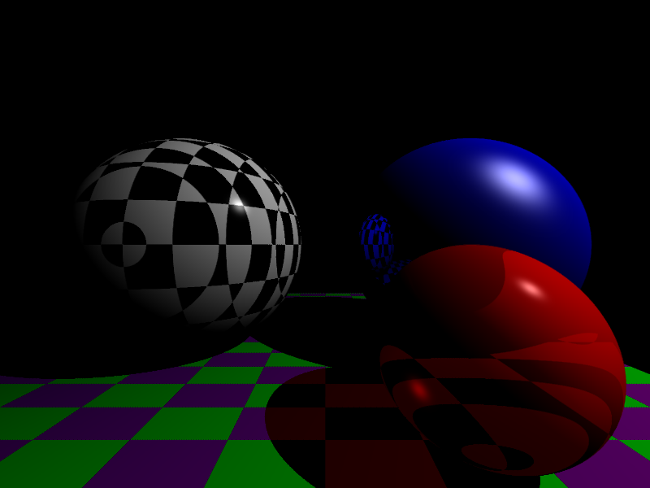

# PARTrace

**🌐 Live demo: <https://raytrace.pardev.net>** — runs entirely in the browser, no GPU.

PARTrace is a pure-CPU JavaScript ray tracer. There is no WebGL or GPU path — every pixel is computed by tracing rays through a scene graph in JavaScript, spread across a pool of Web Workers (one row-slice per CPU core) for parallel rendering. Scenes are data-driven: you edit the scene as JSON in a textarea on the page and click **Render**. It supports reflections, refraction (with Beer's-law absorption), hard and soft shadows, Phong and Blinn-Phong shading, checker/rainbow/combiner materials, depth-of-field, anti-aliasing, and fog.



The screenshot above is the default scene rendered headlessly: a checkered sphere, a reflective blue sphere, a refractive red glass sphere, and a checkered floor with reflections.

## Browser Requirements

A modern browser with support for **ES modules** and **module Web Workers** (`new Worker(url, { type: 'module' })`). Recent Chrome, Edge, Firefox, and Safari all qualify. The renderer runs entirely on the CPU; no GPU or plugins are required.

## Serve Over HTTP (Required)

ES module scripts and module workers **do not load from `file://`** — the browser blocks them with a CORS error. You must serve the directory over HTTP.

The quickest way:

```bash
make serve
# -> http://localhost:5173
```

`make serve` runs the Vite dev server (`vite`) on port 5173, which resolves the ES-module import graph and the module worker on the fly. For a production build, run `make build` and serve the generated `dist/` directory with any static host (`npx serve dist`, nginx, Cloudflare Pages, GitHub Pages — see [Deployment](#deployment)).

## Quick Start

1. Clone and enter the repo.
2. Serve it over HTTP:

   ```bash
   make serve
   ```
3. Open http://localhost:5173 in your browser.
4. The right-hand **Scene** textarea holds the scene JSON (the default scene is preloaded). Click **Render**.
5. Use the **Color / Depth** radio buttons to toggle between the rendered image and a grayscale depth-buffer view. **Save Image** downloads the canvas as a PNG. **Reset** restores the default.

Your edited scene is persisted to `localStorage`, so it survives reloads.

## Editing a Scene

The scene is plain JSON with `#`-prefixed comment lines (stripped before `JSON.parse`). Edit any field and click **Render**. A minimal example:

```json
{
  "maxWorkers": 0,
  "width": 800,
  "height": 600,
  "antiAlias": 1,
  "doReflect": true,
  "doRefract": true,
  "doShadows": true,
  "scene": {
    "bg_color": [0, 0, 0],
    "camera": { "position": [0, 0, -2.5], "fov": 90 },
    "lights": [
      { "type": "point", "position": [5, 5, -3], "shader": "phong",
        "attenuationType": "squared", "fallOffRadius": 12 }
    ],
    "materials": [
      { "name": "blue", "type": "basic", "diffuse": [0, 0, 1],
        "shiny": 16, "reflect": 0.95, "metallic": true }
    ],
    "objects": [
      { "type": "sphere", "material": "blue", "radius": 1,
        "position": [0, 0, 0] }
    ]
  }
}
```

For the complete list of types, fields, ranges, and defaults, see [docs/SCENE_FORMAT.md](docs/SCENE_FORMAT.md).

## Architecture

PARTrace runs in two realms separated by the Worker boundary:

- **Main thread** — the `Partrace` controller in `partrace.js` owns the canvas, spawns one module Web Worker per CPU core, and stitches each worker's row-slice back into the image buffer.
- **Worker realm** — each worker runs the `Partrace` renderer in `partrace-threaded.js`, ray-tracing its assigned horizontal slice of rows. Workers and the main thread communicate solely by `postMessage`.

Vite is the dev server and bundler. The ES-module import graph has two entry points: `src/main.js` (main realm, loaded via `<script type="module">` in `index.html`) and `partrace-worker.js` (the module worker, spawned via `new Worker(new URL('./partrace-worker.js', import.meta.url), { type: 'module' })`, which Vite detects and bundles automatically). Scene-graph files attach their classes to a shared `Partrace` namespace object that each file imports, and `js/registry.js` is the single source of truth mapping JSON type names to constructors.

For the full module graph, the worker message protocol, the namespace-attachment pattern, the `Class.extend` / `_super` convention, and the row-partitioning parallelism, see [docs/ARCHITECTURE.md](docs/ARCHITECTURE.md).

## Development

```bash
make install      # npm install (dev dependencies: ESLint, Vite, fonts)
make build        # vite build -> dist/ (production bundle)
make checkall     # lint + tests (the verification gate)
make lint         # ESLint only
make fmt          # ESLint --fix
make test         # type-registry smoke test + headless render
make screenshot   # regenerate images/screenshot.png from the default scene
make serve        # Vite dev server on http://localhost:5173
make clean        # remove node_modules
```

`make checkall` is the gate: it runs ESLint, a smoke test that instantiates every registered scene type from its JSON name, and a headless render. `make build` produces the static bundle in `dist/` that the GitHub Pages deploy publishes. `make screenshot` renders the default scene in Node and writes `images/screenshot.png`.

There is no type system — the JavaScript is plain ES modules.

## Deployment

The site is published to GitHub Pages at **<https://raytrace.pardev.net>** automatically by [`.github/workflows/deploy-pages.yml`](.github/workflows/deploy-pages.yml) on every push to `main`. The workflow runs `npm ci`, `npm run build` (Vite), and uploads the resulting `dist/` directory as the Pages artifact. The custom domain is configured via the repo-root [`CNAME`](CNAME) file.

## License

MIT. See [LICENSE](LICENSE).
