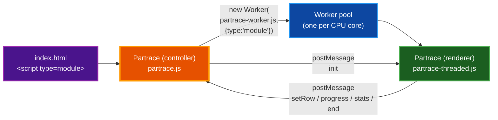
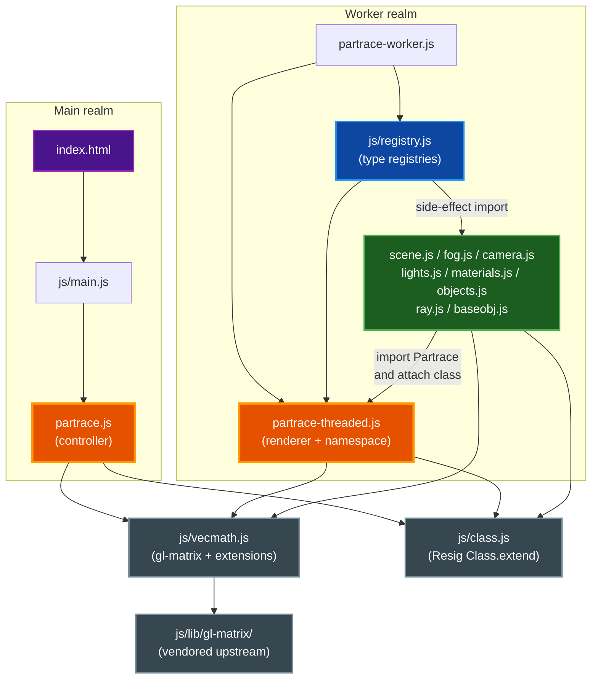

# Architecture

PARTrace is a CPU-only JavaScript ray tracer structured as a main-thread controller plus a pool of Web Worker renderers. This document covers the two-realm split, the ES-module import graph, the worker message protocol, the namespace-attachment pattern, the inheritance convention, the row-partitioning parallelism, and the math layer.

## Table of Contents

- [Two Realms](#two-realms)
- [Module Graph](#module-graph)
- [Worker Message Protocol](#worker-message-protocol)
- [Namespace Attachment Pattern](#namespace-attachment-pattern)
- [Inheritance: Class.extend and \_super](#inheritance-classextend-and-_super)
- [Row-Partitioning Parallelism](#row-partitioning-parallelism)
- [Math Layer](#math-layer)
- [Related Documentation](#related-documentation)

## Two Realms

PARTrace deliberately runs two classes that are both named `Partrace`, kept apart by the Worker realm boundary. This is intentional, and both files document it in their headers.

- **Main realm** — `partrace.js` exports the controller `Partrace`. It owns the `<canvas>`, its image buffers, and the worker pool. It never ray-traces; it dispatches work and stitches results back together. Loaded from `index.html` via `<script type="module" src="/js/main.js">`, which imports `partrace.js`.
- **Worker realm** — `partrace-threaded.js` exports a different `Partrace`: the renderer. Each worker constructs one instance, traces its assigned rows, and posts pixels back. Loaded via `partrace-worker.js`, which the main thread spawns with `new Worker('/partrace-worker.js', { type: 'module' })`.

The two `Partrace` classes never share a module instance — the worker realm imports only `partrace-threaded.js`, never `partrace.js`. jQuery (`$`) is available only in the main realm; the render core is framework-free.



## Module Graph

There is no bundler. The browser resolves two ES-module import graphs, one per realm. `js/registry.js` is the bridge between the two: importing it (for side effects) attaches every scene-graph class to the shared `Partrace` namespace, then builds the JSON-type registries that `Scene.setPropsFromJson` looks up.



Key points:

- `js/main.js` is the main-realm entry; it wires the jQuery UI (Render / Reset / Save buttons, progress bar, buffer toggle) to the controller.
- `partrace-worker.js` is the worker-realm entry; on the first `onmessage` it constructs a renderer, feeds it the setup JSON, and calls `render()`.
- `js/vecmath.js` shallow-copies each gl-matrix namespace into a mutable object, attaches PARTrace's extensions, and re-exports. Nothing else imports gl-matrix directly.
- `js/class.js` is John Resig's `Class.extend` inheritance helper, wrapped as an ESM export.

## Worker Message Protocol

The two realms communicate exclusively by `postMessage`. The full reference lives in the docblock above `onMessage` in `partrace.js`; this is the summary.

### Main → Worker

The main thread sends exactly one message per worker, immediately after spawning it:

| Field | Value | Description |
|-------|-------|-------------|
| `action` | `"init"` | The only action. |
| `setup` | object | The full render setup: `id`, `width`, `height`, `startY`, `endY` (the worker's row-slice), plus `maxWorkers`, `antiAlias`, `aaThreshold`, `doReflect`, `doRefract`, `doShadows`, and the `scene` object. |

### Worker → Main

The worker posts messages tagged by `status`:

| `status` | Payload | When |
|----------|---------|------|
| `start` | `{ id }` | Once, at the beginning of `render()`. |
| `setRow` | `{ id, x: 0, y, cData, zData }` | At the end of every scan row. `cData` is a `Uint8ClampedArray(width·4)` of RGBA pixels; `zData` is a `Float32Array(width)` of depths. The main thread copies these into the matching row of its image and z buffers. |
| `progress` | `{ id, progress }` | Every other row. `progress` is an integer `0`–`100` for this worker's slice. |
| `stats` | `{ id, stats }` | Once, near the end of `render()`. `stats` is the worker's `Scene.stats` object (ray counts, object/light counts, render time). |
| `log` | `{ msg }` | Whenever worker-side code calls `Partrace.log()`. Forwarded to the on-page log. |
| `end` | `{ id }` | The final message. The main thread terminates the worker on receipt. |

The main thread also handles a legacy `setPixel` status (`{ status:'setPixel', parms:{x,y,r,g,b,a} }`), but the current worker emits full rows via `setRow` rather than individual pixels.

### Error Handling

If a worker throws, its `error` event fires `onError` in the controller. The controller terminates the failing worker, marks it done, and increments the workers-done counter. If that counter reaches the pool size, the render is finalized as aborted and the partial image is flushed to the canvas. This prevents the "frozen progress bar forever" failure mode where one worker crash leaves the render waiting on a worker count that can never be reached.

## Namespace Attachment Pattern

Rather than a barrel file of named exports, PARTrace uses a single shared namespace object. The pattern:

1. `partrace-threaded.js` creates `export const Partrace = Class.extend({...})` and hangs the namespace bins `Partrace.Objects`, `Partrace.Lights`, `Partrace.Materials` and the helpers `Partrace.log`, `Partrace.fixColor`, `Partrace.vToBool`, `Partrace.vToVec4` plus the constants `Partrace.bounds` and `Partrace.epsilon` on it.
2. Every scene-graph file does `import { Partrace } from '../partrace-threaded.js'` and attaches its class as a side effect of module evaluation — for example `Partrace.Scene = Class.extend({...})` in `scene.js`, `Partrace.Camera = BaseObj.extend({...})` in `camera.js`.
3. `js/registry.js` imports those files purely for their side effects (no named bindings), then — once the namespace is fully populated — builds the type registries that the JSON loader looks up:

   ```javascript
   Partrace.LIGHT_TYPES    = { point: Partrace.Lights.Point };
   Partrace.MATERIAL_TYPES = { basic, checker, checkermat, rainbow, combiner };
   Partrace.OBJECT_TYPES   = { sphere, plane };
   ```

4. `Scene.setPropsFromJson` is the only bridge from user JSON to constructors: it looks up `Partrace.LIGHT_TYPES[obj.type]`, `Partrace.MATERIAL_TYPES[obj.type]`, and `Partrace.OBJECT_TYPES[obj.type]`. Adding a new scene type means extending the right class, attaching it to the namespace, and adding one line to `registry.js` — no other call sites change.

The main-realm controller in `partrace.js` defines its own, separate `export const Partrace` and does **not** import `partrace-threaded.js`, so the two namespaces never collide.

## Inheritance: Class.extend and \_super

PARTrace uses John Resig's "Simple JavaScript Inheritance" (`js/class.js`). Every class is created with `Class.extend({ ... })` (or `SomeClass.extend({ ... })` to subclass). The conventions:

- Define a constructor as `init: function (...) { ... }`. It runs on `new`.
- Call the parent implementation with `this._super(...)` inside any overridden method. The helper temporarily swaps `_super` onto `this` for the duration of the call, so each override sees its immediate parent.
- `_super` is detected by wrapping methods that reference it; methods that do not mention `_super` are bound directly for speed.

Because ES modules are implicitly strict-mode, `js/class.js` was migrated to an ESM `export const Class = (function () { ... })()` rather than the original IIFE that wrote to the global scope. The `.extend` / `_super` semantics are unchanged.

## Row-Partitioning Parallelism

The controller partitions the image horizontally:

1. `render(setup)` reads `maxWorkers` (defaulting to `navigator.hardwareConcurrency || 2`) and divides the image height into that many equal row-slices.
2. It spawns one module worker per slice, assigning each a contiguous `[startY, endY)` range and a unique `id`.
3. Each worker traces its rows independently — there is no inter-worker communication, only worker→main row postings.
4. On each `setRow` message the controller copies the row's pixels and depths into its own buffers; on each `progress` message it updates the progress bar and periodically redraws the canvas.
5. On each worker's `end` message the controller terminates that worker and increments the done count. When all workers are done, it normalizes the z-buffer, computes aggregate stats, logs the render time, and the render is complete.

The static, per-worker `Scene` is set on `Partrace.scene` at construction. This assumes exactly one scene per realm, which holds because each worker renders one independent image.

## Math Layer

`js/vecmath.js` is PARTrace's only math import. gl-matrix 3.x ESM exposes each module (`vec4`, `mat4`, ...) as a non-extensible namespace object, so PARTrace's parmath-style extensions cannot attach directly. The layer shallow-copies each namespace into a plain mutable object via `Object.assign`, attaches the custom helpers, and re-exports:

- `vec4.reflect`, `vec4.project`, `vec4.combine`, `vec4.crossProduct` (alias `vec4.cross`), `vec4.equals`, `vec4.almostEquals`, `vec4.isNull`, the basis vectors (`XVector`, `YVector`, ...).
- `mat4.getX/getY/getZ/getW`, `mat4.setX/...`, `mat4.createRotate`, `mat4.anglePreservingMatrixInvert`, `mat4.transpose_scale_m33`, `mat4.equals`.
- `Math` helpers: `degToRad`, `radToDeg`, `clamp`, `saturate`, `sqr`.

App modules import math exclusively from `js/vecmath.js`; there is no global pollution. Each helper carries a one-line formula comment at its definition.

## Related Documentation

- [SCENE_FORMAT.md](SCENE_FORMAT.md) — every scene type and field.
- [DOCUMENTATION_STYLE_GUIDE.md](DOCUMENTATION_STYLE_GUIDE.md) — documentation conventions.
- [../README.md](../README.md) — project overview and quick start.
